# kviss

kviss is an internal quiz application for the employees of NAV, and can be accessed at [https://kviss.nav.no/](https://kviss.nav.no/).
It is secured by wonderwall and requires SSO-login via Azure AD/Entra.

## Apps

[web](web)\
Frontend app build using [Remix](https://remix.run/)

[frackend](web/server)\
Frackend app using yarn

[backend](backend)\
Backend built using Kotlin and Ktor. Offers REST API and data storage with Postgres.

## Communication flow

```mermaid
sequenceDiagram

actor H as Host
actor P as Player(s)

participant W as WebSocket
participant A as API

H ->> A: Create game
A ->> H: Game PIN
H ->> W: Connect with PIN
W -->> H: Connected

P ->> A: Join game (with PIN/usr)
A ->> P: Game exists (in lobby) (player data) / does not exist (try again)
P -->> W: Connect to game (playerId)
W -->> H: Player connected
Note right of P: Player in lobby

H -->> W: Start game
A ->> H: Get all questions (?)

loop
    A ->> W: GET question
    W -->> H: Send question & alternatives
    W -->> P: Send alternatives

    P -->> W: Select answer
    W ->> A: Validate answer

    rect rgb(80,80,80)
       W -->> P: Wait for host / all players
       H -->> W: Trigger result screen
    end
    W -->> P: Send answer result and score
    W -->> H: Send leaderboard
    H -->> W: Next question / finish game
end
W ->> A: Close game
W -->> P: Final results
W -->> H: Final leaderboard
Note right of W: Close connection
```

